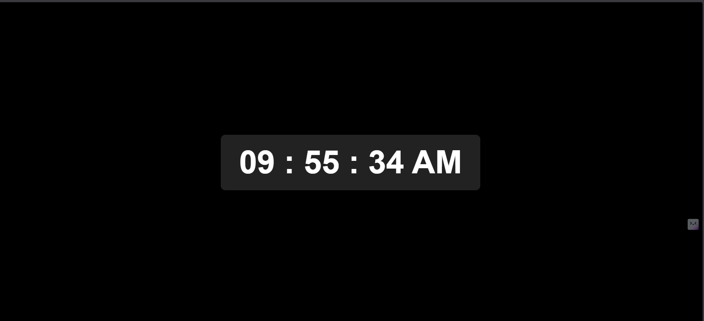

# Digital Clock

A simple digital clock built using **HTML, CSS, and JavaScript** that displays the current time in real time.

## Features
- Displays hours, minutes, and seconds
- Shows AM / PM format
- Updates automatically every second
- Clean and centered UI

## Technologies Used
- HTML
- CSS
- JavaScript

## How It Works
- JavaScript uses the `Date()` object to fetch the current time.
- The clock updates every second using `setInterval()`.
- The time is formatted and displayed dynamically in the DOM.

## Project Structure
# Digital Clock

A simple digital clock built using **HTML, CSS, and JavaScript** that displays the current time in real time.

## Features
- Displays hours, minutes, and seconds
- Shows AM / PM format
- Updates automatically every second
- Clean and centered UI

## Technologies Used
- HTML
- CSS
- JavaScript

## How It Works
- JavaScript uses the `Date()` object to fetch the current time.
- The clock updates every second using `setInterval()`.
- The time is formatted and displayed dynamically in the DOM.

## Project Structure
# Digital Clock

A simple digital clock built using **HTML, CSS, and JavaScript** that displays the current time in real time.

## Features
- Displays hours, minutes, and seconds
- Shows AM / PM format
- Updates automatically every second
- Clean and centered UI

## Technologies Used
- HTML
- CSS
- JavaScript

## How It Works
- JavaScript uses the `Date()` object to fetch the current time.
- The clock updates every second using `setInterval()`.
- The time is formatted and displayed dynamically in the DOM.

## Project Structure
Digital-Clock
│
├── index.html
├── style.css
└── script.js

## Author
Gulshan Kumar

## Preview
