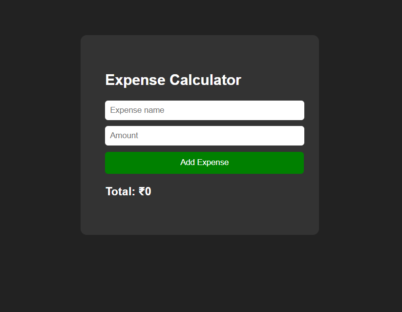

# Expense Calculator

A simple Expense Calculator built using **HTML, CSS, and JavaScript** that allows users to add expenses, calculate totals, and delete items dynamically.

## Features
- Add expenses with name and amount
- Automatic total calculation
- Delete individual expenses
- Input validation for empty or invalid entries
- Clean and minimal UI

## Technologies Used
- HTML
- CSS
- JavaScript

## How It Works
- Expenses are stored in a JavaScript array as objects.
- Each expense contains a title and price.
- The total is calculated using the `reduce()` method.
- The UI updates dynamically whenever an expense is added or deleted.

## Project Structure
# Expense Calculator

A simple Expense Calculator built using **HTML, CSS, and JavaScript** that allows users to add expenses, calculate totals, and delete items dynamically.

## Features
- Add expenses with name and amount
- Automatic total calculation
- Delete individual expenses
- Input validation for empty or invalid entries
- Clean and minimal UI

## Technologies Used
- HTML
- CSS
- JavaScript

## How It Works
- Expenses are stored in a JavaScript array as objects.
- Each expense contains a title and price.
- The total is calculated using the `reduce()` method.
- The UI updates dynamically whenever an expense is added or deleted.

## Project Structure
Expense-Calculator
│
├── index.html
├── style.css
└── script.js
## Author
Gulshan Kumar
## Preview

