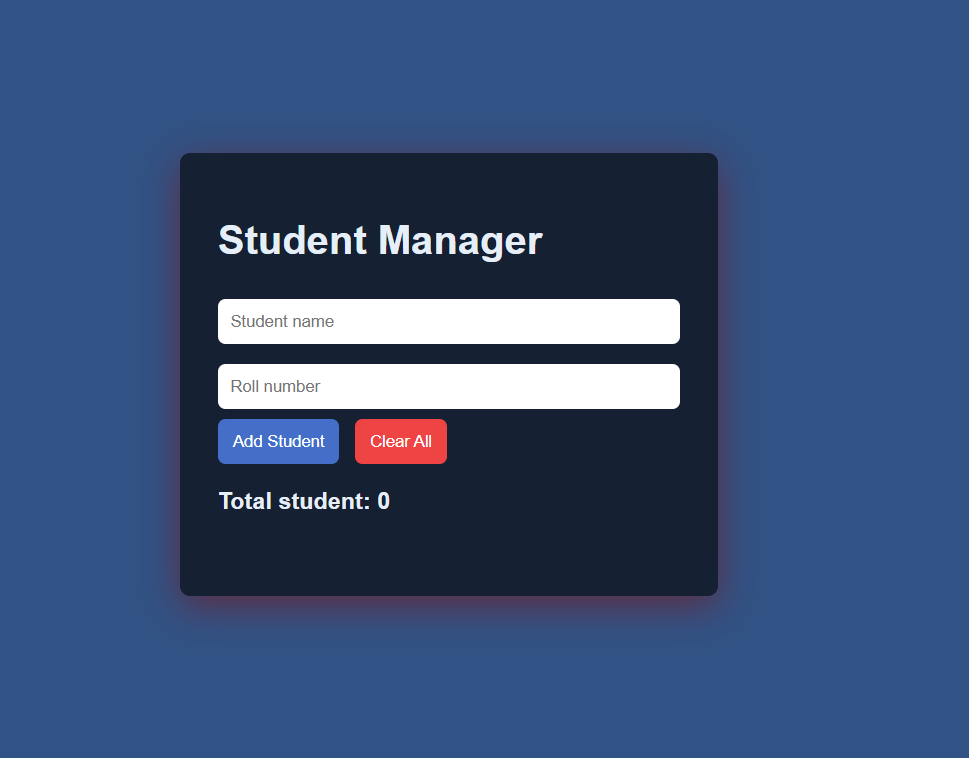

# Student Management System

A simple Student Management System built using **HTML, CSS, and JavaScript** that allows users to add, delete, and manage student records dynamically.

## Features

- Add students with name and roll number
- Delete individual students
- Clear all students at once
- Automatic student count update
- Input validation
- Clean and responsive UI

## Technologies Used

- HTML
- CSS
- JavaScript

## How It Works

- Student data is stored in an array of objects.
- Each student object contains an id, name, and roll number.
- The UI is dynamically updated whenever a student is added or removed.
- The total number of students updates automatically.

## Project Structure

Student-Management-System
│
├── index.html
├── style.css
└── script.js

## Concepts Practiced

- Arrays and Objects
- Destructuring
- Spread Operator
- filter() method
- DOM Manipulation
- Event Listeners
- Dynamic Rendering

## Author
Gulshan Kumar

## Preview

