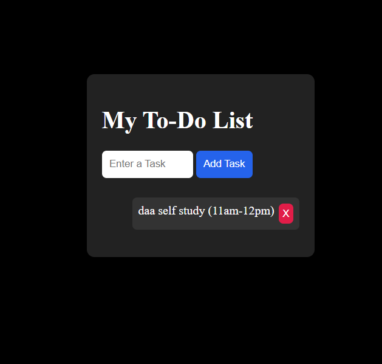

# To-Do List App

A simple To-Do List application built using **HTML, CSS, and JavaScript** that allows users to add, delete, and persist tasks using LocalStorage.

## Features
- Add tasks dynamically
- Delete individual tasks
- Press Enter to quickly add tasks
- Data persists after page refresh
- Clean and minimal UI

## Technologies Used
- HTML
- CSS
- JavaScript
- LocalStorage

## How It Works
- Tasks are stored in a JavaScript array.
- Whenever a task is added or deleted, the UI is re-rendered.
- Tasks are saved in LocalStorage using `JSON.stringify()`.
- On page load, tasks are retrieved using `JSON.parse()` and displayed automatically.

## Project Structure
Todo-List-App
│
├── index.html
├── style.css
└── script.js

## Concepts Practiced
- Arrays
- LocalStorage
- DOM Manipulation
- Event Listeners
- Dynamic Rendering
- JSON.stringify() and JSON.parse()

## Author
Gulshan Kumar

## Preview

