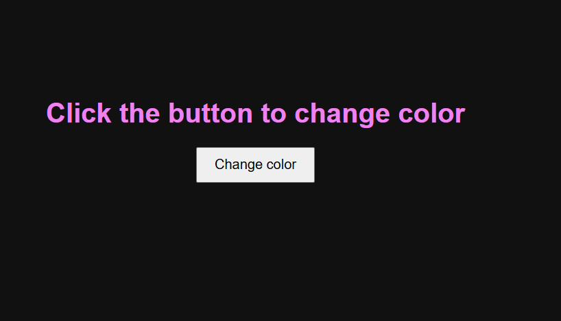

# Color Changer

A simple Color Changer project built using **HTML, CSS, and JavaScript**.  
Clicking the button changes the text color randomly from a predefined set of colors.

## Features
- Random color generation
- Button click event handling
- Dynamic DOM updates
- Centered UI using Flexbox

## Technologies Used
- HTML
- CSS
- JavaScript

## How It Works
- A list of colors is stored in a JavaScript array.
- When the button is clicked, a random index is generated.
- The text color is updated dynamically using JavaScript and DOM manipulation.

## Project Structure
Color-Changer
│
├── index.html
├── style.css
└── script.js

## Concepts Practiced
- Arrays
- Math.random()
- Event Listeners
- DOM Manipulation
- CSS Flexbox

## Author
Gulshan Kumar
## Preview
